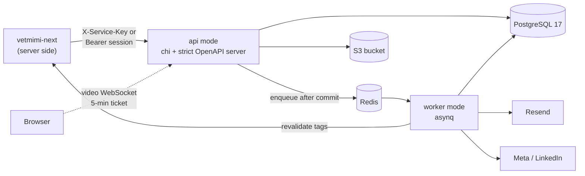

<div align="center">

# VetMiMi — API

**The Go API behind VetMiMi, an art therapy practice in Sydney. It handles appointment booking, WebRTC video sessions, a publishing portal for the website and social channels, media, and email.**

[Website](https://vetmimi-arts-therapy.vercel.app) · [Web app repo](https://github.com/VetMiMi/vetmimi-next) · [Architecture](docs/architecture.md) · [Project board](https://github.com/orgs/VetMiMi/projects/1)

[](https://github.com/VetMiMi/vetmimi-api/actions/workflows/ci.yml)


</div>

---

## About

VetMiMi is Daw Mi's art therapy practice in Sydney. This repository is its backend: one Go binary that owns the database, admin sign-in, booking rules, video signaling, content and email. The Next.js app in [vetmimi-next](https://github.com/VetMiMi/vetmimi-next) is the only thing that calls it over HTTP. The one exception is the video WebSocket, which browsers open directly with a short-lived ticket.

It is designed for its real scale: one practitioner, tens of appointments a month, and one or two admins. It also aims to be correct under concurrency, and it never logs a client's personal data.

## Find your way around

### The folders

| Path | What it holds |
|---|---|
| `cmd/api/` | `main`: one binary with four modes (`api`, `worker`, `create-user`, `healthcheck`) |
| `internal/httpapi/` | Routes, middleware and handlers, one file per API area; `gen/` is generated from `openapi.yaml` |
| `internal/booking/` | Services, availability, slots, appointments and their background tasks |
| `internal/video/` | Video rooms, room tickets and the WebSocket signalling hub |
| `internal/content/` | The publishing portal: posts, channel versions, workflow, publishing |
| `internal/media/` | Image uploads, resizing and the S3 bucket |
| `internal/comms/` | Email rows, templates, delivery through Resend, contact enquiries |
| `internal/auth/` | Admin accounts, sign-in (password and TOTP), sessions, roles, lockout |
| `internal/meta/`, `internal/linkedin/` | Connecting and posting to Facebook and Instagram, and to LinkedIn |
| `internal/assistant/` | AI suggestions for posts through the Anthropic API |
| `internal/db/` | sqlc output (generated); `queries/` holds the SQL you edit |
| `internal/config/` | Environment variables, read and checked once at start-up |
| `internal/postgres/` | The pgx pool and the migrations |
| `internal/queue/` | asynq tasks, the queue and the worker |
| `internal/settings/` | The `settings` table: rules Daw Mi can change without a deploy |
| `internal/idempotency/` | `Idempotency-Key` storage for creates |
| `internal/tokens/` | Session tokens, signed links, booking references, OAuth state |
| `internal/secretbox/` | AES-256-GCM for stored secrets (TOTP secrets, OAuth tokens) |
| `internal/ratelimit/` | Fixed-window request counters in Redis |
| `internal/listing/` | Keyset cursors and search for the admin lists |
| `internal/apperr/` | Typed errors with a stable code |
| `internal/clock/` | The current time, fixed in tests |
| `internal/pgtest/`, `internal/redistest/` | A test database per test binary, and Redis for tests |
| `migrations/` | goose SQL migrations, embedded in the binary |
| `openapi.yaml` | The HTTP contract |
| `deploy/` | Dockerfile, Compose, Caddy, coturn and Terraform for the live host |
| `scripts/` | `gate.sh` (the machine-wide lock) and the contract-version check |
| `docs/` | Architecture, data model, social setup guides, ADRs |

### How a request flows

A visitor asks for an appointment: `POST /public/appointments`.

1. **Contract.** `openapi.yaml` declares the operation `createPublicAppointment`, secured by `serviceKey`, with a required `Idempotency-Key` header.
2. **Generated interface.** `make generate` adds `CreatePublicAppointment` to `gen.StrictServerInterface` in `internal/httpapi/gen/api.gen.go`. `NewRouter` in `internal/httpapi/router.go` mounts it.
3. **Middleware**, in the order `router.go` runs it:
   - every route: `requestID`, `realIP`, `logRequests`, `recoverPanics`, `setSecurityHeaders`
   - then `WithTimeout` (30 s) and `WithBodyCap` (64 KiB)
   - then per operation (`mountAPI`): `requireServiceKey`, `requireSession`, `requireRoles`, the rate limit (`limitsByOperation`: 5 per 10 minutes per visitor IP), `operationLimits`, `validateRequests`. Each check acts only when the operation's `security` asks for it.
4. **Handler.** `server.CreatePublicAppointment` in `internal/httpapi/booking_public.go` turns the body into a `booking.Request`.
5. **Domain.** `booking.RequestAppointment` in `internal/booking/requests.go` opens one transaction (`inSchedule`, which takes the schedule lock). It checks the idempotency key, the settings, the service, the booking window and the slot, then calls `InsertAppointment` and `AppendEvent`.
6. **SQL.** `InsertAppointment` and `LockSchedule` live in `internal/db/queries/appointments.sql`; sqlc generates `internal/db/appointments.sql.go`. If the exclusion constraint rejects an overlap, `refusal` in `internal/booking/booking.go` turns it into `409 slot_unavailable`.
7. **Email row.** `notifyRequested` calls `comms.Queue` (`internal/comms/comms.go`), which inserts a `communications` row in the same transaction and returns a `comms:deliver` task. Booking adds a `booking:expire-hold` task.
8. **After commit.** The handler calls `s.enqueue`, which puts the tasks on Redis, and answers `201` with the receipt. Any error becomes a Problem body in `responseError` (`internal/httpapi/problem.go`).
9. **Worker.** `comms.Tasks.Deliver` (`internal/comms/deliver.go`, registered in `cmd/api/worker.go`) locks the row, renders `templates/request_received.<locale>.tmpl`, sends it through Resend with the row id as the idempotency key, and marks it `sent`. If Redis lost the task, `comms:sweep` finds the row within 5 minutes.

### Add an endpoint in 6 steps

1. **Contract.** Add the operation to `openapi.yaml`: an `operationId`, a tag and one `security` entry. Raise `info.version`. A new tag also goes in `include-tags` in `oapi-codegen.yaml`.
2. **Generate.** Run `make generate`. The build now fails until the new method on `gen.StrictServerInterface` exists.
3. **Handler.** Write the method in `internal/httpapi/<area>.go`: parse, call one domain function, map the result.
4. **Domain.** Write the function in its `internal/<package>`. It takes `context.Context` and a pool or `db.Querier`, and returns `apperr` errors.
5. **Query.** Add the SQL to `internal/db/queries/<table>.sql` and run `make generate` again. A schema change is a new migration (`make migrate-new NAME=...`).
6. **Tests.** A success and a failure test for the domain function against real PostgreSQL, and a handler test in `internal/httpapi`.

Then fill in the tables in `internal/httpapi`:

| Table | File | When |
|---|---|---|
| `rolesByOperation` | `roles.go` | Every `sessionToken` operation. Without a row, nobody may call it, and `TestEverySessionOperationHasRoles` fails. |
| `limitsByOperation` | `ratelimit.go` | Only if it needs its own limit. Otherwise it shares its scheme's limit (1,200/min per service key, or 300/min per session). |
| `bodyCapByOperation`, `timeoutByOperation` | `middleware.go` | Only if 64 KiB or 30 s is not enough. |

## Features

**Booking**
- **Services**, each bookable either directly or by enquiry, with durations and buffer times before and after a session.
- **Availability** from weekly hours, date overrides and blocks. Available slots are calculated in Sydney time and handle daylight saving correctly: the repeated hour in April and the missing hour in October are both tested.
- **Public booking requests** are safe to retry, because each one carries an idempotency key. If the slot was taken in the meantime, the API offers up to 5 alternative times within the next 14 days.
- **A pending request holds its slot** for 48 hours by default, until Daw Mi confirms or declines it.
- Admins can confirm, decline, reschedule, cancel, complete, mark a no-show, add notes and create appointments manually. Every change is checked against a status table and protected against two admins editing at once.
- **Clients manage their own appointment from a private link:** view it, cancel it, or ask to reschedule.
- **Contact enquiries**, plus a daily purge of old records (after 24 months by default).

**Video sessions**
- A private room is created for each confirmed online appointment. It opens 15 minutes before the start and closes 60 minutes after the end.
- Joining takes a 5-minute room ticket. The API relays offers, answers and ICE candidates over a WebSocket, and issues time-limited TURN credentials for coturn. Nothing is recorded.

**Publishing portal**
- **Posts** have versions for the website, Facebook, Instagram and LinkedIn. Each post goes through an editorial workflow: idea, draft, review, approved, scheduled, published.
- **Approval checks each platform's rules.** For example, Instagram needs an image and allows at most 2,200 characters and 30 hashtags, and a True Story needs the client's consent.
- **Publishing** to a Facebook Page, its Instagram account and LinkedIn through OAuth connections. The website version becomes a public article and the site refreshes it. If a channel isn't connected, Daw Mi gets the text to post herself.
- **AI suggestions** draft each channel's version and translations through the Anthropic API. This is optional and turns off cleanly without a key.

**Media and email**
- **Image uploads** up to 20 MiB. EXIF data is stripped and the image is rotated upright, then resized to 1600, 800 and 400 px JPEGs in an S3-compatible bucket.
- **Transactional email** through Resend: 12 kinds of message, each in English and Burmese, with appointment reminders.

**Admin auth**
- **Sign-in needs** email, password (argon2id) and a **TOTP** code; accounts created with `--no-totp` sign in with the password alone until two-step setup moves into the admin website.
- **Sessions** expire after 12 hours idle or 7 days at most.
- **Lockouts and rate limits** slow down repeated failed sign-ins.
- **Roles:** site admin, booking admin and content editor.

## How it's built

- **The database prevents double-booking.** Each appointment stores the time it blocks, buffers included, and a PostgreSQL exclusion constraint rejects any overlap:

  ```sql
  EXCLUDE USING gist (practitioner_id WITH =, busy_range WITH &&)
    WHERE (status IN ('pending', 'confirmed'))
  ```

  A rejected overlap becomes a `409 slot_unavailable` response with alternative times. Changes to availability and new bookings also take turns through an advisory lock. A test races two writers for the same slot and checks that only one wins.
- **A pending request *is* the hold.** Its expiry time is stored on the row, and a CHECK constraint ties it to the pending status. The worker expires it on time, and a 5-minute sweep catches anything missed. A reschedule is a single `UPDATE`, so the new time is secured before the old one is released.
- **Emails are durable records** ([ADR-006](docs/adr/006-communications-as-durable-records.md)). Email rows are written in the same transaction as the change that caused them, and only the row id is queued. A sweep rebuilds anything Redis lost, the row id is Resend's idempotency key, and reminders are re-checked at the moment they are sent.
- **Links are safe even if the database leaks.** Manage and join links are derived with HMAC-SHA256 from a stored seed. The database keeps only the seed and a hash of each link, so a database dump contains no working links.
- **The OpenAPI contract drives security.** Each of the contract's 89 operations must declare how callers authenticate, or the server refuses to start. Access rules follow each operation's declaration, not its URL path. An admin operation without a roles row is refused to everyone. Requests are validated against the spec, and errors are `application/problem+json` with stable codes.
- **Signaling** ([ADR-007](docs/adr/007-one-to-one-webrtc-with-go-signaling.md)): one connection per role per room, a reconnect replaces the old socket, frames are capped at 16 KiB, and the hub re-reads room state every 30 s so the worker can end sessions.
- **Privacy-preserving rate limits.** Requests are counted in fixed windows in Redis under hashed keys, so no IP address or email address is stored. Sign-in fails closed when Redis is down; other requests fail open.
- **The contract is versioned across repos** ([ADR-003](docs/adr/003-openapi-first-contract.md)). CI rejects a change to `openapi.yaml` that doesn't raise its version, and merging tags the new version. The web app pins that tag and regenerates its client types from it.

## Tech stack

| Layer | Technology |
|---|---|
| Language | Go 1.27, one binary with `api`, `worker`, `create-user` and `healthcheck` modes |
| HTTP | chi, oapi-codegen (strict server from `openapi.yaml`), kin-openapi request validation, coder/websocket |
| Data | PostgreSQL 17 (pgx, sqlc, goose migrations embedded in the binary), `btree_gist` exclusion constraints |
| Jobs | Redis + asynq (email, reminders, hold expiry, publishing, sweeps, retention) |
| Integrations | Resend (email), S3-compatible storage, coturn (TURN), Meta Graph API, LinkedIn API, Anthropic Messages API |
| Security | argon2id, TOTP (pquerna/otp), AES-256-GCM for stored secrets (`secretbox`), HMAC-derived tokens |
| Quality | `go test -race`, real-PostgreSQL integration tests, staticcheck, golden-file email templates |

## Architecture



The database has 20 migrations. Statuses are `text` with a `CHECK`, admin-edited rows carry a `version` for optimistic locking, and translatable text is a `jsonb` with `en` and `my` keys.

[`docs/architecture.md`](docs/architecture.md) has the components, the error codes, the roles and walkthroughs of booking, confirmation, reminders, video join and publishing. [`docs/data-model.md`](docs/data-model.md) has every table.

## Getting started

**Prerequisites:**
- Go 1.27
- PostgreSQL 17 and Redis (Homebrew is fine; Docker isn't needed locally)
- *optional:* an S3-compatible endpoint such as MinIO, for media uploads

```sh
brew services start postgresql@17 && brew services start redis
createdb vetmimi && createdb vetmimi_test
make tools
cp .env.example .env
set -a; . ./.env; set +a
make dev
```

- `make tools` installs the pinned sqlc, oapi-codegen, goose and staticcheck.
- Fill in `.env`. Nothing loads it for you, so `set -a; . ./.env; set +a` exports it into your shell.
- `make dev` runs the API on `:8080` and migrates on start. Check it with `curl localhost:8080/healthz`.
- Run `make worker` in a second terminal for background jobs.

**Create the first admin.** Run this in a terminal (it needs a TTY):

```sh
go run ./cmd/api --mode create-user --email you@example.com --name "Your Name" \
  --roles site_admin --practitioner
```

It asks for a password twice, prints an `otpauth://` URI for your authenticator app, and saves nothing until you enter a valid code. `--practitioner` marks the person appointments are booked with, and booking needs exactly one. Running it again for the same email resets the password and TOTP secret and signs that user out everywhere. `--no-totp` skips the authenticator step and saves (or resets to) a password-only account.

**Environment variables:** [`.env.example`](.env.example) lists each one with its purpose.

| Group | Variables |
|---|---|
| Always required | `DATABASE_URL`, `REDIS_URL`, `SERVICE_KEY`, `SIGNING_SECRET` (32+ bytes), `TOTP_ENCRYPTION_KEY` (base64 of 32 bytes), `PUBLIC_API_URL`, `SITE_URL` |
| Required in production | `SITE_REVALIDATE_SECRET`, `RESEND_API_KEY`, `EMAIL_FROM`, `MEDIA_S3_*`, `MEDIA_PUBLIC_URL`, `TURN_HOST`, `TURN_SECRET` |
| Optional | `META_APP_ID` + `META_APP_SECRET`, `META_CONFIG_ID`, `LINKEDIN_CLIENT_ID` + `LINKEDIN_CLIENT_SECRET`, `ANTHROPIC_API_KEY`, `PORT`, `LOG_LEVEL` |
| Tests | `DATABASE_URL_TEST`, `REDIS_URL_TEST` |

On startup the config check reports every problem at once and never prints a value. In development, email without a Resend key is only logged, without contents, and media uploads are refused when no bucket is configured.

**Calling it:** public routes need the `X-Service-Key: $SERVICE_KEY` header (for example `GET /public/booking/services`). Admin routes need a `Bearer` token from `POST /auth/sessions`.

Setting up the social connections: [`docs/meta-setup.md`](docs/meta-setup.md), [`docs/linkedin-setup.md`](docs/linkedin-setup.md).

## Testing

```sh
make test-pkg PKG=./internal/booking
make gate
go test ./internal/comms -update
```

- `make test-pkg` tests one package. Use it while you work.
- `make gate` is lint, the whole suite, build and the generated-code drift check, behind the machine-wide lock. CI runs the same. Run it once before you push.
- `-update` rewrites the email golden files in `internal/comms/testdata`.

What the tests promise:

- **About 470 tests in 84 files.** Integration tests run against **real PostgreSQL**, with no mocks: each test binary gets its own migrated database, which is dropped afterwards. If the test databases aren't configured, the run fails rather than skipping.
- **Every external API is tested against a fake HTTP server:** Resend, Meta, LinkedIn and Anthropic.
- **Each behaviour gets a success test and a failure test**, and anything touching scheduling gets a concurrency test.
- **CI** (`.github/workflows/ci.yml`) also runs the deployment checks (shellcheck, the deploy and compose tests, `caddy validate`, an image build, `terraform validate`), the contract-version check and the Conventional Commits check. `contract-tag.yml` tags each new contract version on `main`.

## Deployment

Written and checked, not yet applied: [ADR-010](docs/adr/010-live-host-on-ec2-with-the-website.md) and the runbook in [`deploy/README.md`](deploy/README.md).

- **Live host:** one AWS EC2 `t4g.small` in Sydney (`deploy/terraform/live`), running Docker Compose with the API and worker (one image), the website, PostgreSQL 17, Redis 7, Caddy and coturn.
- **Releases:** after CI passes on `main`, `release.yml` builds an arm64 image, pushes it to ECR through GitHub's OIDC role and deploys over SSH. A release that fails its health check within a minute is rolled back.
- **Backups and alarms:** a nightly `pg_dump` to a private S3 bucket, kept 30 days; CloudWatch emails the owner on failed status checks, high CPU, memory or disk.
- **Later:** ECS Fargate with RDS (ADR-005). Not written yet; see [`deploy/terraform/README.md`](deploy/terraform/README.md).

## Project status

The foundation, booking and contact, video, and the publishing portal milestones are complete. Launch work is in progress: deployment and backups, a runbook and handover guide, and Daw Mi's review of the English and Burmese emails.

Four operations are already in the contract but not served yet: manual meeting links, and the communications list, resend and mark-as-sent. See the [project board](https://github.com/orgs/VetMiMi/projects/1) and [open issues](https://github.com/VetMiMi/vetmimi-api/issues).

## Documentation

- [`docs/architecture.md`](docs/architecture.md): components, request lifecycle, error codes, roles, background jobs
- [`docs/data-model.md`](docs/data-model.md): tables and constraints
- [`docs/adr/`](docs/adr): decision records 001–010
- [`AGENTS.md`](AGENTS.md): the working agreement and code style
